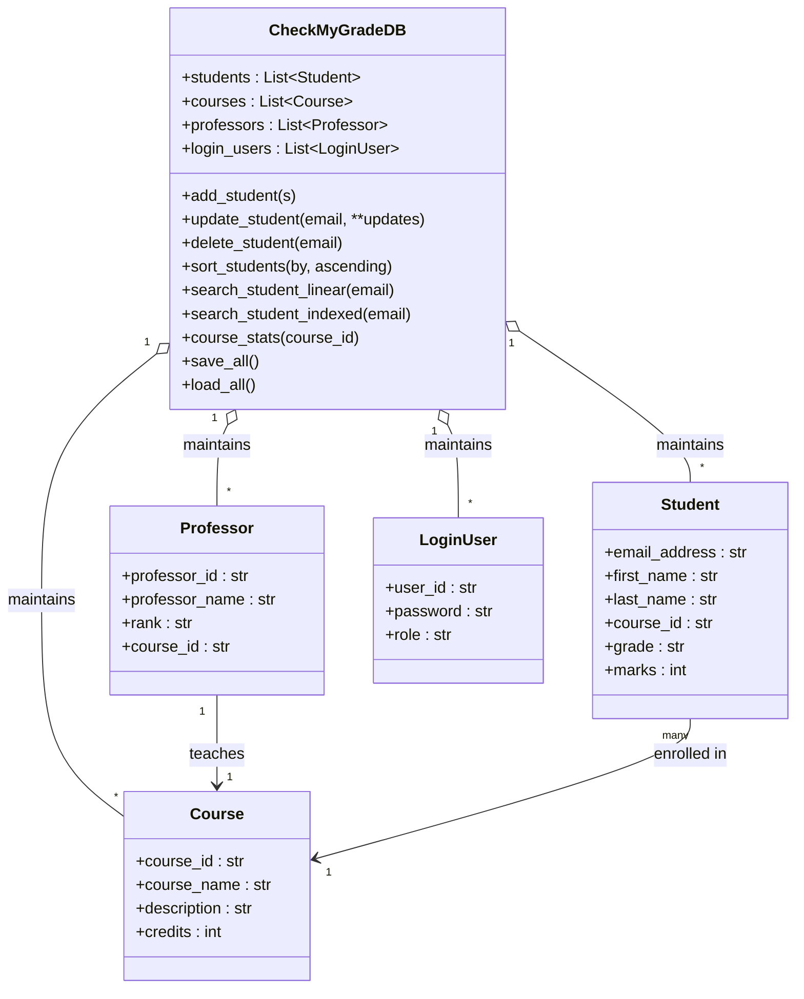

# CheckMyGrade — Lab 1 starter

Console-based Python app using object-oriented design and CSV storage.

## What this includes
- Classes: `Student`, `Course`, `Professor`, `LoginUser` (+ `GradeRange`), and a `CheckMyGradeDB` repository.
- Data structure: Python lists (dynamic arrays) to store students/courses/professors + a simple index dict for faster email lookups.
- CRUD: add / delete / modify for student, course, professor.
- Sorting: by email, marks, name, or grade (timed).
- Searching: linear vs indexed (timed with `time.perf_counter()`).
- Stats: course average and median.
- Reports: course-wise, professor-wise, student-wise.
- CSV I/O: four files — `students.csv`, `courses.csv`, `professors.csv`, `login.csv`.
- Passwords: encrypted (XOR + random IV + base64) so the file stores a random-looking string and can be decrypted on login.
- Unit tests: generate 1,100 students, exercise CRUD, sorting, searching, and stats, and print timings.

## Run the console app
```bash
# from the repository root
export PYTHONPATH=.
python -m checkmygrade.main
```
The first run seeds a few example records; use option 9 to save and 10 to reload later.

## Run tests
```bash
export PYTHONPATH=.
python -m unittest -v
```

## CSV Schemas (headers match the assignment examples)
- `students.csv`: `Email_address,First_name,Last_name,Course.id,grades,Marks`
- `courses.csv` : `Course_id,Course_name,Description,Credits`
- `professors.csv`: `Professor_id,Professor_Name,Rank,Course.id`
- `login.csv` : `User_id,Password,Role`

## Notes
- The symmetric encryption used here is **for the lab only**; do not use it in production.
- The data structure requirement “array or linked list” is satisfied by Python lists.
  If you want to switch to a linked list, you can wrap the `students` list with a custom
  linked structure; the rest of the interfaces can stay the same.


## Class diagram (Mermaid)



## Git quick start
```bash
git init
git add --all
git commit -m "Module 1 — CheckMyGrade Lab starter"
git branch -M main
git remote add origin <your-repo-url>
git push -u origin main
```
